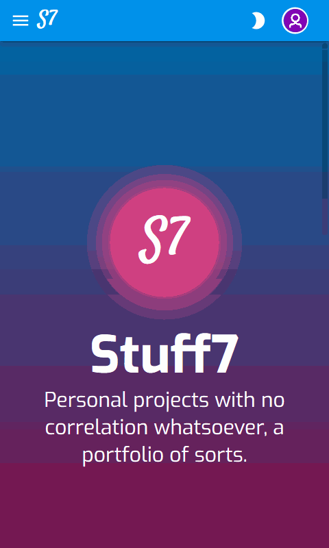

# Stuff7 (WIP)

React portfolio application using MaterialUI design, redux and typescript.

  

* CustomAPIs
Text APIs for bots in streaming platforms supporting both Twitch and Mixer. Including follow date, follow age, uptime, account age, among others.

* Pokédex
Consumes the public PokeAPI to retrieve a list of Pokémon and details about them such as stats, graphs, etc.

* TVSM
Fetch and store info from any series using the TVmaze API.

## Built With
* [React Scripts](https://www.npmjs.com/package/react-scripts)
* [Webpack](https://webpack.js.org/)

## Using
* [React](https://reactjs.org/)
* [Redux](https://redux.js.org/)
* [Typescript](https://www.typescriptlang.org/)
* [MaterialUI](https://material-ui.com/)

## Authors

* **Armando Muñoz** - [Stuff7](https://github.com/Stuff7)

## License

This project is licensed under the MIT License - see the [LICENSE](LICENSE) file for details
